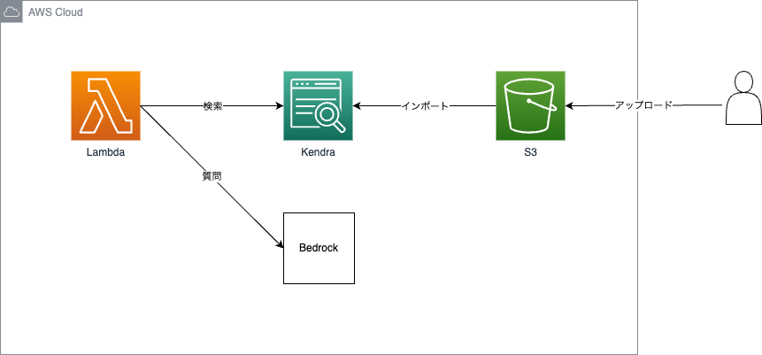

# rag-with-bedrock

## 概要

RAGのサンプルシステムをAWS Lambda、Amazon Bedrock、Amazon Kendra、Amazon S3で実装しています。  

## 構成図



## デプロイ手順

1. 以下コマンドでリポジトリをクローンし、ディレクトリを移動

```bash
git clone https://github.com/tsukuboshi/rag-with-bedrock
cd rag-with-bedrock
```

2. 以下コマンドで、SAMアプリをビルド

```bash
sam build
```

3. 以下コマンドで、SAMアプリをデプロイ

```bash
sam deploy 
  [--parameter-overrides]
  [SysName=<システム名>]
  [Env=<環境>]
  [BedrockModelID=<BedrockモデルID>]
  [KendraEdition=<Kendraエディション>]
  [KendraDSBucketPrefix=<S3バケットプレフィックス>]
  [LogRetentionDays=<ログ保持日数>]
```

## パラメータ詳細

|パラメータ名|デフォルト値|指定可能な値|説明|
|---|---|---|---|
|SysName|cm|(任意の文字列)|システム名|
|Env|prd|prd/stg/dev|環境名|
|BedrockModelID|anthropic.claude-instant-v1|anthropic.claude-instant-v1/anthropic.claude-v2|Bedrockで使用するモデルのID|
|KendraEdition|ENTERPRISE_EDITION|ENTERPRISE_EDITION/DEVELOPER_EDITION|Kendraで選択可能なエディション|
|KendraDSBucketPrefix|awsdoc|(任意の文字列)|Kendraデータソースが検索可能なS3プレフィックスの範囲|
|LogRetentionDays|365|(CloudWatch Logsで指定可能な保持期間日数)|LambdaとKendraにおけるCloudWatch Logsの保持日数|

## 参考文献
